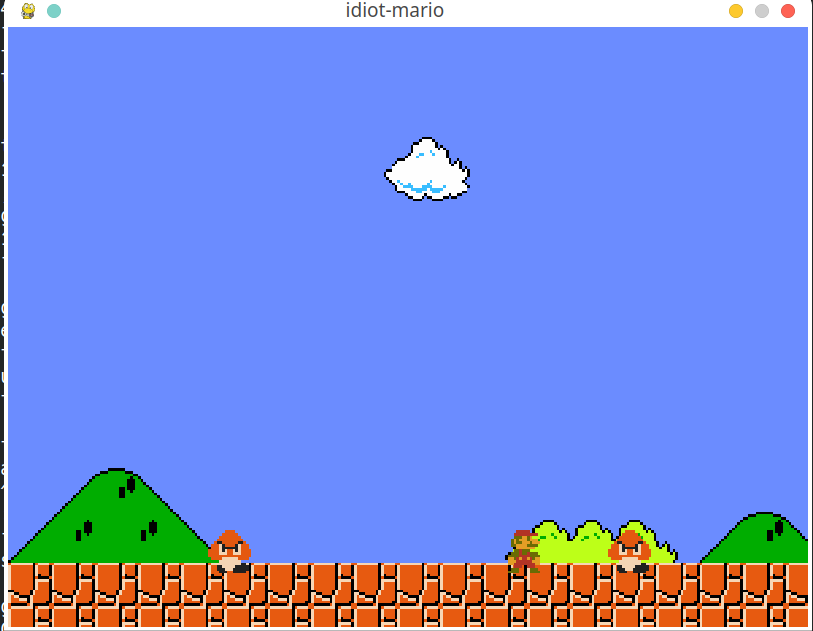

# idiot-Mario

- Student Name:YANG HAN
- Github Username:yang-yang621
- Semester:2023 FALL
- Course:CS5001

## Description
This project aims to reproduce a mario like game. This game includes a start menu and a scene with a mario and two enemies. By working on this project, I learnt the general develop process of a game and have a general idea the data structure of a game.
## Key Features
This game has a controlable mario and two enemies that could hurt mario.
## Guide
In order to run this game, you need to get in src/ folder. And then `python ./main.py` needs to be run. The first scene is the menu of this game. In this scene, Press Enter can enter the next scene, which is the game scene. In this scene, there is a mario and two enemies. Press left and right to control mario move. If mario hits an enemy, It dies.
## Installation Instructions
This project needs two dependencies, which includes in requirements.txt. These requirements could be installed by running `pip install -r requirements.txt`. 
## Code Review
```python
def move(self, key):
        if key[pg.K_RIGHT]:
            self.walk(direction=True)
        elif key[pg.K_LEFT]:
            self.walk(direction=False)
        elif key[pg.K_UP]:
            self.jump(key)
        else:
            self.x_vel = 0

    
    def walk(self,direction):
        if direction:
            frames = self.right_frames
            self.x_vel = 5
        else:
            frames = self.left_frames
            self.x_vel = -5
        
        if self.frame_index == 0:
            self.frame_index += 1
            self.walk_timer = self.current_time
        else:
            if(self.current_time - self.walk_timer) < 100:
                if self.frame_index < 3:
                    self.frame_index += 1
                else:
                    self.frame_index = 1
                self.walk_timer = self.current_time
        self.image = frames[self.frame_index]
```
This part of code shows how mario actions are handled in this game.  
In move(), input is handled first. direction shows where mario should be heading. If direction is true, mario is heading right, left otherwise. walk() change the the speed of mario and the image of mario so that it looks like walking.
### Major Challenges
The major challenges of this project is getting a deep understand of how game process should work. 
## Example Runs

## Testing

## Missing Features / What's Next
Two features are missing. First , mario can't jump now, so that it can't kill enemies so far. Second, Game scene can't move now, further scene can't be shown. In the next stage, I could add more items like coin box and other enemies. Now the speed on x_axis is fixed, an Accelrate could be added to Mario in the future
## Final Reflection
As the semester draws to a close, I find myself contemplating the journey that was CS5001. This challenging term, filled with rigorous assignments and numerous revisions, left me at times feeling overwhelmed, yet it was an invaluable part of my educational growth.

The course deepened my understanding of Python, not just as a programming language but as a tool that simplifies and enhances the programming process. The lessons on software design, particularly the structuring of functions, stood out as a highlight. They transformed my approach to Python, enabling me to appreciate its practicality and efficiency in real-world applications. The final project was a testament to this, where the use of command lines and functions allowed for the creation of efficient, reusable code snippets, streamlining my workflow significantly.

Throughout the semester, I faced many challenges and encountered difficulties that were previously foreign to me. However, these obstacles did not deter me. On the contrary, they fueled my resolve. Choosing to work with Pygame was a decision born not from confidence but necessity, a choice that pushed me out of my comfort zone and into a realm of immense learning and growth.

This course has not only equipped me with substantial Python knowledge but also prepared me mentally for future endeavors in programming. As I move forward to tackle more complex languages like C and Java, the experiences and lessons learned from CS5001 will serve as a source of inspiration and motivation.

I extend my heartfelt gratitude to Professor Albert, all the teaching assistants, and my peers in group assignments. Their support and guidance have been pivotal in my journey through CS5001, making this challenging yet rewarding experience one that I will cherish and remember.
